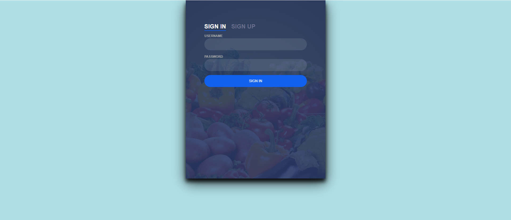
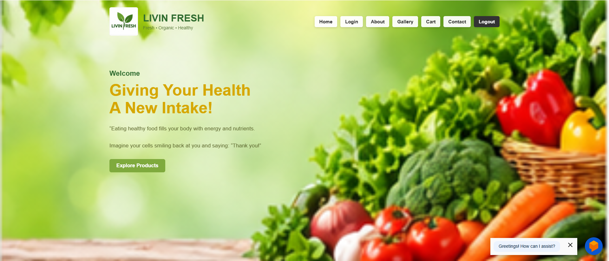
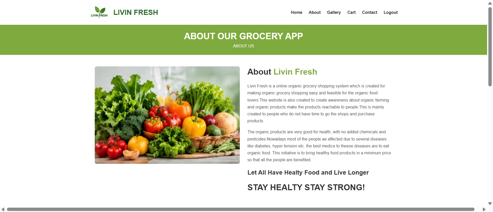
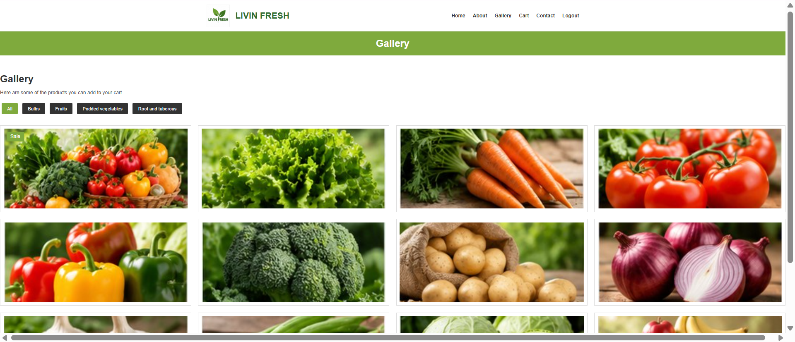
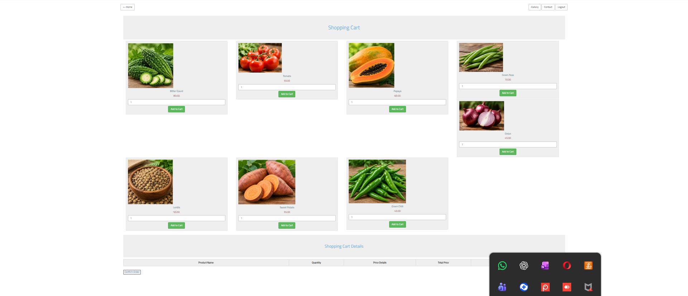
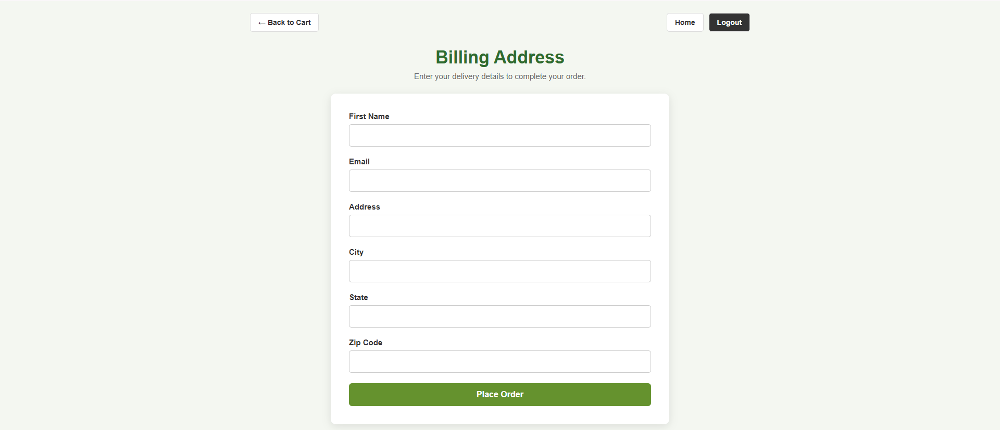
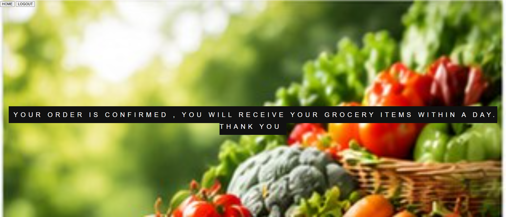
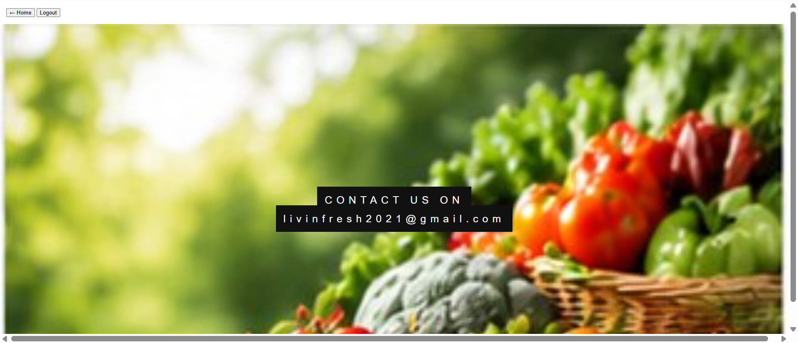

# 🛒 Livin Fresh – Online Organic Grocery Shopping System

## 🚀 Overview

**Livin Fresh** is an online organic grocery shopping system designed to provide users with a convenient platform for discovering and purchasing organic grocery products.

The application combines core e-commerce functionality such as user registration, login, product browsing, cart management, checkout, and order confirmation with an integrated chatbot that assists users with information related to organic products and farming.

The project demonstrates the development of a full-stack web application using PHP and MySQL along with front-end web technologies.

---

## 👥 Project Context

This project was originally developed as a **team-based academic project** as part of the Computer Science and Business Systems programme.

The repository is maintained as part of my personal portfolio to demonstrate the technical concepts, development experience, and skills gained through the project.

> **Portfolio Reconstruction:** This repository contains a reconstructed version of the original academic project, recreated from the available project documentation after the original development files were no longer available. The current implementation preserves the key functionality and workflow of the original system while using reconstructed code and replacement visual assets where the original files were unavailable.

---

## 🎯 Objective

The objective of the project is to develop an online platform that simplifies organic grocery shopping while supporting product discovery, cart management, order processing, and user assistance.

The system was also designed to promote awareness of organic products and organic farming while providing a digital platform through which customers can explore organic grocery products.

---

## 🛠 Technology Stack

| Category | Technology |
|---|---|
| Front-End | HTML, CSS, JavaScript |
| Back-End | PHP |
| Database | MySQL |
| UI Framework | Bootstrap |
| JavaScript Library | jQuery |
| Chatbot | Google Dialogflow API |
| Development Environment | XAMPP |
| IDE | Visual Studio Code |
| Domain | E-Commerce / Organic Grocery |

---

## 📊 Project Workflow

The primary application workflow is:

```text
Registration / Sign Up
        ↓
       Login
        ↓
       Home
        ↓
Browse Organic Products
        ↓
Product Gallery
        ↓
Select Products
        ↓
Add to Cart
        ↓
Manage Cart
        ↓
Confirm Order
        ↓
Enter Billing / Delivery Details
        ↓
Place Order
        ↓
Order Confirmation
```

Users can also access supporting pages such as **About** and **Contact**, while the integrated chatbot provides additional assistance.

---

## ✨ Key Features

### 👤 User Registration and Login

Users can register and access the application through the login interface.

### 🏠 Home Page

Provides the main entry point to the Livin Fresh platform and navigation to the major application modules.

### 🥬 Organic Product Gallery

Displays organic grocery products and categories for easier product discovery.

### 🛒 Shopping Cart Management

Users can:

- Add products to the cart
- Select product quantities
- Remove products from the cart
- View individual product totals
- View the overall cart total

### 💳 Checkout and Order Processing

Users can enter billing and delivery information before placing an order.

### ✅ Order Confirmation

After successful checkout, the application displays an order confirmation message.

### 🤖 Dialogflow Chatbot

A Google Dialogflow chatbot is integrated into the application to provide user assistance and information related to organic products and farming.

### 📞 Contact and About Pages

Additional pages provide information about the platform and allow users to access contact information.

---

## 🧩 System Design

The application follows a web-based client-server architecture.

The front end is developed using **HTML, CSS, JavaScript, Bootstrap, and jQuery**, while **PHP** handles server-side processing.

**MySQL** is used to store application data including user, product, and order-related information.

The reconstructed database structure is separated into the following databases:

- `login_page` – login-related data
- `sign_up` – registration-related data
- `product_details` – grocery product information
- `livinfresh` – order information

SQL setup files are available in the [`database`](database/) directory.

---

## 💡 Key Learnings

Through this project, I gained practical exposure to:

- Full-stack web application development
- PHP-based server-side programming
- MySQL database integration
- User registration and login workflows
- E-commerce shopping cart functionality
- Checkout and order-processing workflows
- HTML, CSS, and JavaScript development
- Bootstrap-based interface development
- jQuery
- Google Dialogflow chatbot integration
- Database-driven product management
- Designing an end-to-end e-commerce user journey

The reconstruction process also provided an opportunity to revisit the original system architecture, database design, application workflow, and integration between front-end and back-end components.

---

## 📷 Application Screenshots

### Login / Sign Up




### Home Page



### About Page



### Product Gallery



### Shopping Cart




### Checkout




### Order Confirmation



### Contact Page



---

## 🗄 Database Setup

The SQL files required for the reconstructed application are available inside the `database` directory.

### Databases

```text
livinfresh
login_page
sign_up
product_details
```

### Setup

1. Start **Apache** and **MySQL** using XAMPP.
2. Open phpMyAdmin.
3. Create or import the required databases using the SQL files available in the `database` directory.
4. Verify that the required tables have been created successfully.
5. Update the local database connection settings in the PHP files if your MySQL configuration uses a different port or credentials.

> The current reconstructed development environment uses a local XAMPP/MySQL configuration. Local database settings may need to be adjusted depending on the user's environment.

---

## ▶️ Running the Application Locally

### Prerequisites

- XAMPP
- PHP
- MySQL
- Web browser

### Steps

1. Clone or download this repository.

2. Place the project folder inside the XAMPP `htdocs` directory.

Example:

```text
C:\xampp\htdocs\livinfresh
```

3. Start **Apache** and **MySQL** from the XAMPP Control Panel.

4. Import the SQL files available in the `database` directory through phpMyAdmin.

5. Open the application in your browser.

Example:

```text
http://localhost/livinfresh/loginindex.php
```

6. Register or sign in and navigate through the application.

---

## 🔐 Privacy and Security

The database files included in this repository contain only reconstructed or non-sensitive sample data intended for portfolio demonstration.

Personal customer information, private credentials, and testing data containing personal information have been removed before publication.

> **Note:** This project is an academic/portfolio implementation and is not intended to represent a production-ready authentication or payment system.

---

## 📈 Project Outcome

The project demonstrates an end-to-end organic grocery shopping workflow combining product discovery, user interaction, cart management, database operations, checkout, order processing, and chatbot-based assistance.

Reconstructing the application from the surviving project documentation also enabled the original academic work to be converted into a functional portfolio project that demonstrates both technical implementation and understanding of the underlying business workflow.

---

## 👩‍💻 Author

**Varsha Sundararaj**

Business Analytics Postgraduate @ Dublin Business School

Aspiring Data Analyst | NLP | SQL | Python

---

## 🔗 Connect With Me

**LinkedIn:**  
https://www.linkedin.com/in/varsha-sundararaj-40a463201

**GitHub:**  
https://github.com/varshasundararaj-analytics
